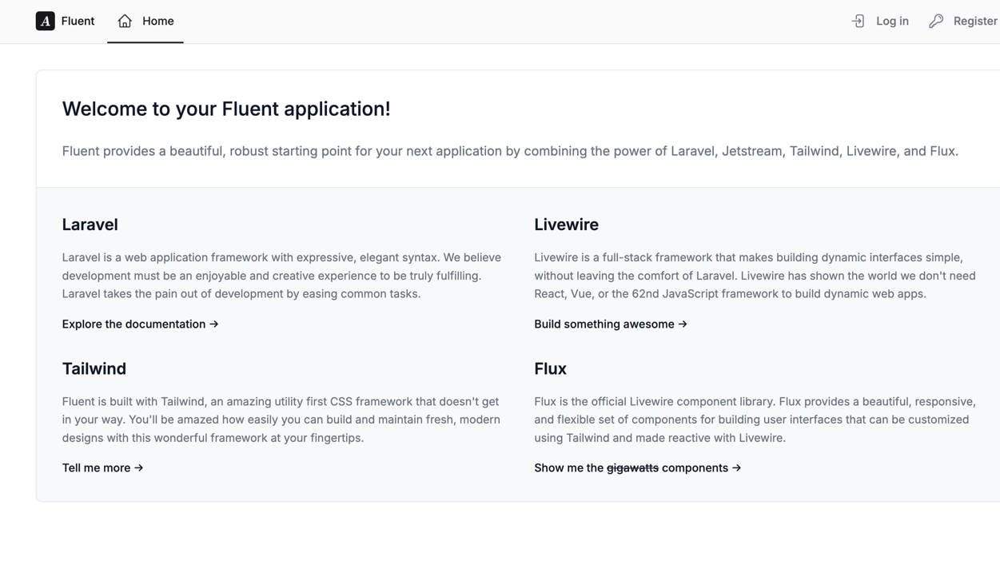
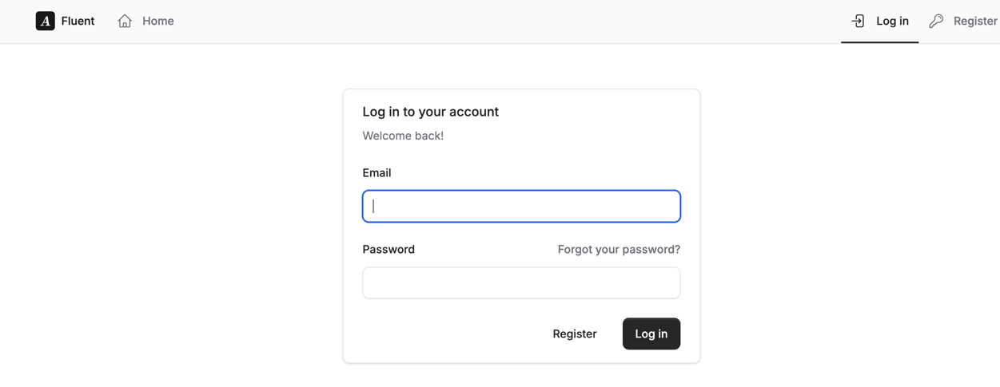
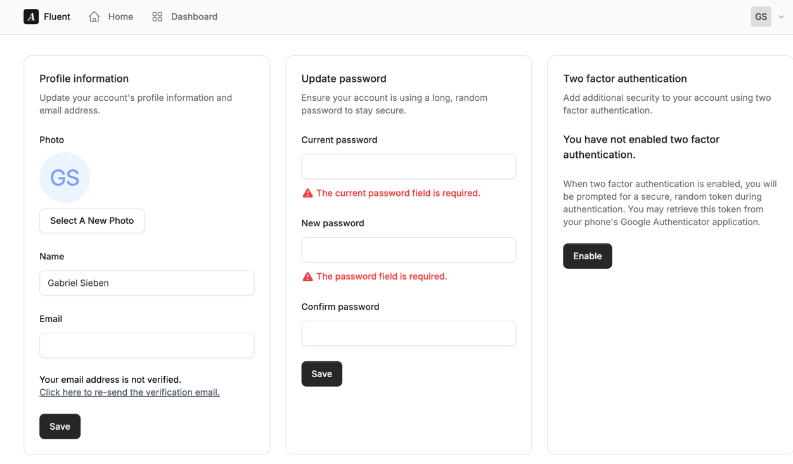

## Fluent - A starter kit for Laravel, Livewire, and Flux

Caleb Porzio, the developer of Laravel, launched Flux at Laracon 2024 to much applause. He also bragged that he solved the pains of layouts.

This was true; but without a starter kit, it's a bit challenging to figure out where to start.

Fluent is a starter kit based on the most commonly used parts of Laravel Jetstream, beautifully redone in Flux. Only 9 Jetstream components remain - everything else, from the inputs, to the buttons, to every form, is built with Flux.

You can also feel comfortable knowing you aren't starting with any forks. The backend of Jetstream has been completely untouched. This does mean we're stuck with Jetstream's expectations for how its own modals work (and why we can't get rid of those last components easily), but that's a small price to pay for staying fully upstream. :)

## Photos

## Supported features
Everything in Jetstream except for API Tokens and Teams. Because Jetstream has not been modified, the backend is still there if you want to build UI for it. You probably would've needed to make changes anyway.

The other Jetstream and Fortify feature flags (including for disabling registration, disabling two-factor authentication, enabling/disabling profile photos, etc.) are supported with different UI for those settings.

## Note about Flux
A license for Flux (technically, "Flux Pro") is required to use Fluent. Fluent does not contain any of Flux's CSS, built CSS, or Blade components.

The good news is that Caleb Porzio is a great guy, he gave us Livewire for free, you'll make the $129 back in a few hours, and he gives out Purchasing Power Parity (PPP) discounts. Considering this starter kit and Flux will save you weeks, it's a great deal.

## Installation
1. Clone the repository
2. Run `composer install`
3. Copy `.env.example` to `.env`
4. Modify `.env` to your liking (particularly the database)
5. Run `php artisan key:generate`
6. Run `php artisan migrate`
7. Run `npm install`
8. Run `npm run build`

There will be additional instructions shown when you finish. These steps will guide you through activating Flux Pro and setting up your own Git repository.

## Contributing
Your contributions are welcome and appreciated. Just make sure to `composer remove livewire/flux-pro` and run `npm build` *before* submitting *any* pull requests. We also cannot accept modified Flux components, because that would require disclosing the source code to Flux, which is not allowed.
